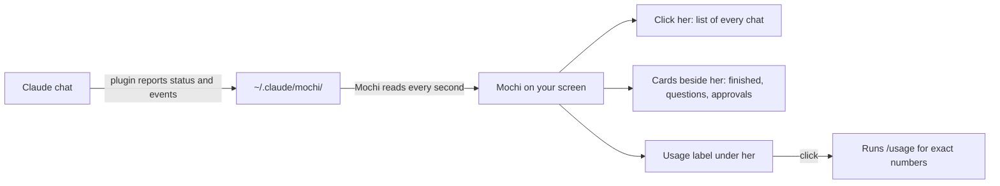

# Mochi

> **Work in progress.** Mochi works day to day, but parts are still changing, and some things may break. Feedback and issues are welcome.

  

Mochi is a pixel-art companion for [Claude Code](https://claude.com/claude-code) on macOS. She sits above your message box, floats on your desktop, and keeps you informed about every chat without you having to watch them.

## Features

- **Status at a glance.** Working, needs your OK, ready, or blocked, shown by her pose, her badge, and her colours.
- **Notifications beside her.** Finished work, questions, and tool approvals appear as Liquid Glass cards next to her. A sound plays when a chat needs you.
- **Every chat in one list.** Click her to see all your recent chats and their latest news. Click a line to open that chat in Claude.
- **Plan usage.** A label under her shows your 5-hour and weekly limits. Clicking it asks Claude for the exact numbers, the same as `/usage`, and shows when you can continue after you run out.
- **Skins.** Six looks, chosen from her right-click menu under **Skin**.

  

## How it works

| Mochi | Meaning |
| --- | --- |
| Walking, dots on her badge | Claude is working |
| Red clock, sound | Claude needs your OK or has a question |
| Hopping, green check | Claude has finished; she stays "ready" until your next message |
| Grey, squinting | A reply was interrupted or failed |

The project has two parts:

| Part | What it is |
| --- | --- |
| `pet-mod/` | A Claude Code plugin. It reports what each chat is doing. |
| `mochi-desktop/` | A macOS app that shows Mochi on your screen. |

## Requirements

- macOS 13 or later. The Liquid Glass look needs macOS 26; earlier versions use a frosted style.
- Claude Code 2.1 or later, with the Claude desktop app.
- Xcode command line tools (`xcode-select --install`), to build the app.

## Installation

The simplest way is to open Claude Code and say:

> Follow CLAUDE-SETUP.md in this folder to set up Mochi.

To install by hand, follow the steps in [CLAUDE-SETUP.md](CLAUDE-SETUP.md).

## Privacy

- Mochi reads and writes files only in `~/.claude/mochi/` and in the Claude app's own folders.
- Mochi's own code makes no network requests.
- The usage check runs the copy of Claude that comes with the app. That copy contacts Anthropic's servers to read your usage, the same way `/usage` does. Nothing is sent that you haven't already sent through Claude.

## Background

Claude didn't have a pet, so I made one for myself. I wanted a companion that lives alongside my work: one that tells me when things finish, asks for my attention when a chat needs me, and shows how much of my limit is left, without my having to watch every chat.

### History

1. **A text pet in the side panel.** A small character with a status line, drawn with Claude Code's plugin system.
2. **A pet that walks.** It moved while Claude worked, and reacted when work finished or was blocked.
3. **A strip above the message box.** It moved out of the side panel, so it no longer took up space.
4. **Pixel art.** A 16×16 pixel cat with a status badge, later with a blinking, animated look.
5. **A floating app.** Mochi became her own small window that you can drag anywhere, with a list of every chat.
6. **Notification cards.** Finished work, questions, and approvals appear beside her as Liquid Glass cards that open their chat when clicked.
7. **Plan usage.** A label showing your 5-hour and weekly limits, and when you can continue.
8. **Skins.** Six looks to choose from.

## Roadmap

- Clean screenshots of the notification cards and usage panel
- Sign and notarise the desktop app so it opens without warnings
- Start automatically at login from the plugin, not only from the app's menu
- Support for Claude chats outside Claude Code

## Licence

MIT. See [LICENSE](LICENSE).
