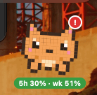
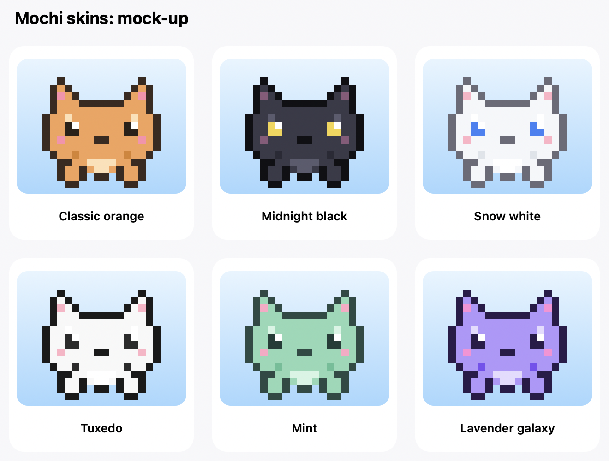
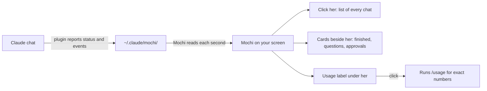

# Mochi

  

A pixel-art cat for Claude. She sits above your message box in Claude Code, floats on your Mac, and tells you what every Claude chat is doing:

- **Status:** working, needs your OK, ready, or blocked, with a badge and colours.
- **Notifications:** Liquid Glass cards beside her for finished work, questions, and tool approvals, with a sound when a chat needs you.
- **Click her** to see every chat and its latest news. Click a line to jump to that chat in Claude.
- **Six skins:** classic orange, midnight black, snow white, tuxedo, mint, and lavender galaxy. Pick one from her right-click menu under **Skin**.
- **Plan usage:** a label under her shows your 5-hour and weekly limits, and clicking it asks Claude for the exact numbers, the same as `/usage`. When you run out, she shows when you can continue.

Two parts work together:

| Part | What it is |
| --- | --- |
| `pet-mod/` | A Claude Code plugin. It tells Mochi what each chat is doing. |
| `mochi-desktop/` | A small macOS app that shows Mochi on your screen. |

## Skins

  

## How it works

| Mochi shows | When |
| --- | --- |
| **Working** (walking, dots on her badge) | Claude is answering |
| **Needs you** (red clock, sound) | Claude needs your OK for a tool, or asks a question |
| **Ready** (hopping, green check) | Claude has finished; she stays ready until your next message |
| **Blocked** (grey, squinting) | A reply was interrupted or failed |

## Why Mochi exists

Claude didn't have a pet, so I made one for myself. I wanted a little companion that lives with my work: one that tells me when things finish, asks for my attention when a chat needs me, and shows me how much of my limit I have left, without my having to watch every chat.

## History

Mochi grew one request at a time:

1. **A text pet in Claude's side panel.** A small ASCII character with a status line, using Claude Code's mod system, which lets a plugin draw inside the app.
2. **A pet that walks.** The pet moved back and forth while Claude worked and reacted when it finished or was blocked.
3. **A strip above the message box.** The pet moved out of the side panel into a thin strip above the message box, so it no longer took up space on the screen.
4. **Pixel art and colour.** The character became a 16×16 pixel cat with a status badge, and later a blinking, animated look in the desktop app.
5. **A floating app.** Mochi became her own small window on the Mac that you can drag anywhere, plus a list of every chat you have open.
6. **Notifications beside her.** Finished work, questions, and approvals appear as Liquid Glass cards next to her, each one opening its chat when clicked, with a sound when a chat needs you.
7. **Plan usage.** A label under her shows your 5-hour and weekly limits. Clicking it asks Claude for the exact numbers, the same as `/usage`, and shows when you can continue after you run out.
8. **Skins.** Six looks, from classic orange to lavender galaxy, chosen from her right-click menu.

## Setting it up

The easiest way is to open Claude Code and say:

> Follow CLAUDE-SETUP.md in this folder to set up Mochi.

Or follow the steps by hand in [CLAUDE-SETUP.md](CLAUDE-SETUP.md).

## Requirements

- macOS 13 or later (the Liquid Glass look needs macOS 26)
- Claude Code 2.1 or later, with the desktop app
- Xcode command line tools (`xcode-select --install`)

## Privacy

Mochi reads only the files Claude Code writes on your own Mac, in `~/.claude/mochi/` and the Claude app's own folders. It makes no network calls of its own. Usage checks run the copy of Claude that comes with the app, which reads your usage the same way `/usage` does.

## Licence

MIT. See [LICENSE](LICENSE).
